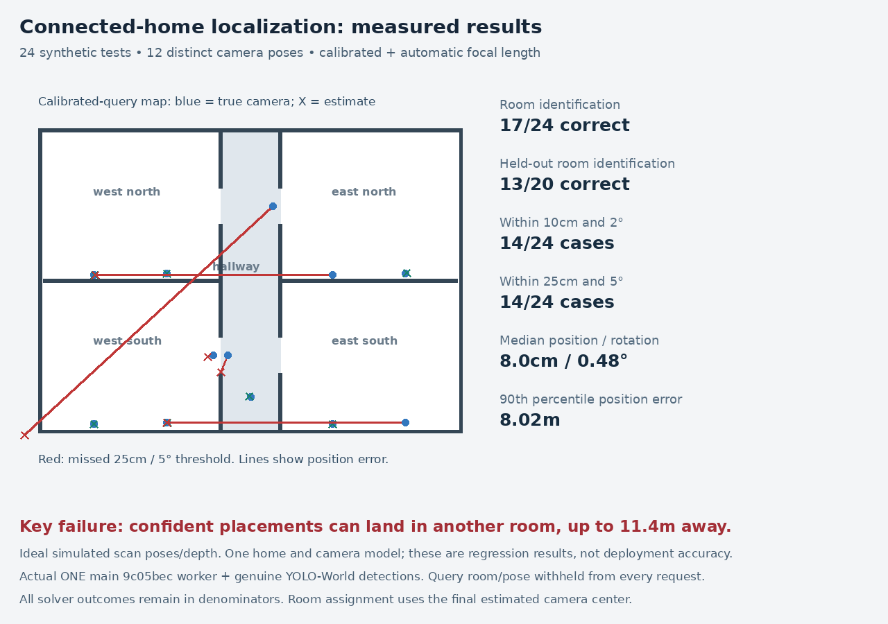

# Connected-home localization QA

A generated four-room home with a continuous hallway and real doorways, tested against ONE main `9c05becdc3af59b15092075c1eb1dc90e2ab9e70` without application changes.

## Held-out result

**13/20 correct room assignments; 10/20 within 10cm and 2°.** Those are ten distinct held-out poses under two calibration conditions. Including development cases: 17/24 correct rooms and 14/24 within either 10cm/2° or 25cm/5°. All calls returned `positioned`; worst position error was 11.39m.

The fixture exposes confident wrong-room placements in similar-looking rooms and doorway views. This is one synthetic stress fixture with ideal scan reference poses/depth, not a real-home acceptance rate. See [full results](pilot/RESULTS.md), [raw numeric summary](pilot/results_summary.json), and [independent verification](audit/independent_final_validation.json).



## Model and camera samples

- [Simple USDZ: 49 cuboids, no detailed meshes](pilot/fixtures/connected_home/connected_home_simple_boxes.usdz)
- [Normalized synthetic RoomPlan scan](pilot/fixtures/connected_home/normalized_scan.json)
- [Native-contract provenance and validation](pilot/fixtures/connected_home/normalized_scan_validation.json)
- [Camera example](pilot/fixtures/connected_home/query_west_south_0.jpg)
- [Repeated-room alias example](pilot/fixtures/connected_home/query_east_south_1.jpg)
- [Hallway example](pilot/fixtures/connected_home/query_transition_0.jpg)
- [Doorway failure example](pilot/fixtures/connected_home/query_transition_3.jpg)

All 20 original scan-reference JPEG/depth pairs and 12 query JPEGs are retained under `pilot/fixtures/connected_home/`. Geometry uses metres, Y-up in the USDZ/RoomPlan data. Four 1.2m-wide doors connect four furnished rooms to a 2m-wide hallway.

## Exact replay without large duplicate payloads

The original report describes local ZIP deliverables. This repository instead stores the same requests compactly: a shared landmark/map payload in SHA256-checked gzip parts, exact query-frame bytes, per-case detections/calibration, and compressed original results. Every checked-in file is below 200KB. The model weights and duplicate 95MB request JSON tree are not checked in.

From this directory:

```sh
python restore_replay.py --check-only
python restore_replay.py
export ONE_SOURCE_ROOT=/absolute/path/to/one
export PYTHONPATH="$ONE_SOURCE_ROOT"
python audit/independent_final_validation.py
cd pilot
python summarize_connected.py
```

The first command verifies byte-exact reconstruction of all 24 frozen requests and all 24 original result files without writing or running models. The second restores them locally. Source verification expects the evaluated revision's application and legacy QA files; use the recorded revision if application code has changed.

For a new solver run, use the environment recorded in `pilot/environment.lock.txt` and a fresh output label:

```sh
python benchmark_serial.py --source "$ONE_SOURCE_ROOT" --label rerun
python summarize_connected.py --label rerun
```

The 180-second deadline, 10cm/2° and 25cm/5° thresholds remain fixed. Query room/pose, person anchors and previous pose priors are absent from solver requests. Reference poses/depth are ideal simulated scan inputs. The model checkpoint hashes are in `pilot/model_provenance.json`.

## Regenerate the fixture

`pilot/base_scene.py` and `pilot/build_connected.py` generate the furniture, connected shell, original camera schedule, RGB renders and axial depth. Use Blender 4.3.2:

```sh
blender -b -t 2 --python pilot/build_connected.py
python pilot/package_connected.py
python audit/build_connected_native_fixture.py
```

Run genuine YOLO-World detection with `pilot/detect.py`, providing `ONE_GEOMETRY_MODEL_PATH`, `ONE_GEOMETRY_MODEL_CONFIG`, cache/device settings and `PYTHONPATH`; then run `pilot/prepare_connected.py`. Published harness changes only resolve the application source using `ONE_SOURCE_ROOT`; the original frozen outputs are unchanged. Regenerating on another renderer/dependency build may change bytes; the compact replay is the authoritative original evaluation input.

## Provenance and scope

Scenes, furniture, textures and camera images were created procedurally for this test using Blender/Cycles. No external photographs or stock art were used. The furniture recipe derives from this repository's earlier `qa/multiroom-localization` generator. No third-party image attribution is required. YOLO-World/CLIP checkpoint files are not redistributed; their identity is recorded for reproducibility.

The normalized scan uses required `native-ios`/`RoomPlan` schema literals solely for contract validation. It is explicitly synthetic, not an iPhone or LiDAR capture. Tests call real worker functions and final-pose room assignment, not HTTP upload/persistence. The backend does not automatically persist `camera.room_id`; an already assigned camera may restrict its map. No application fixes, model retraining, merging or deployment were performed.

A next improvement would retain competing room hypotheses and abstain when room evidence is ambiguous, then evaluate new held-out cases.
