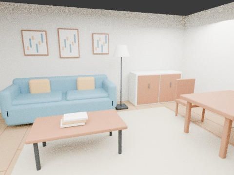

# Synthetic living-room scene

Regenerated assets reconstructed from the earlier scene recipe. These are new bytes, not the exact images used in the historical benchmark. No recognition/localization metrics have been rerun on these regenerated files.

## View and download

- [Download USDZ](assets/room.usdz) (open file, then Download raw file)
- [Editable Blender scene](assets/room.blend)
- [Asset validation](assets/validation.json)
- [Authored object placements](assets/semantic_objects.json)

The 6 by 5 meter room includes sofa, coffee table, dining table, two chairs, cabinet, television and floor lamp. Camera renders and USDZ use the same actual mesh geometry. The overview hides two side walls for illustration only. No GPT Image generation is used because calibrated multi-view geometry must stay consistent.

## Reproduce

Use Blender 4.3.2 and Python with usd-core 26.8:

    blender -b -t 8 --python qa/synthetic-room-2026-09-30/generate.py
    python qa/synthetic-room-2026-09-30/package_usdz.py

The scripts create the assets directory next to themselves. USDZ uses meters and Y-up. Validation checks all available OpenUSD validators and USDZ archive alignment. Apple Quick Look/device viewing is not tested.

## Historical benchmark, not current-byte verification

The earlier synthetic test on backend commit e6abb03a803f403371626cfc2636c831308d71a3 used real YOLO-World plus CLIP and reported 22/27 instance matches with 3 extra detections (88% precision, 81.5% recall at IoU 0.5), held-out camera error 4.96 cm / 0.494 degrees, and 15 passing API/localization/privacy checks. Those exact test artifacts were lost when the temporary workspace reset. This branch preserves rebuilt display/model artifacts, not a claim those scores were rerun.

The held-out query used RGB plus known intrinsics only. Its reference map used rendered RGB-D, known reference poses/intrinsics and normalized synthetic RoomPlan geometry. This was relocalization into an ideal known map, not reconstruction from an arbitrary single image. Three identical frames tested temporal gating, not motion tracking.

The earlier test found the two genuine tables collapsed into one last-seen record: non-person object lookup is label-only, followed by a five-second per-object throttle (app/main.py lines 4552–4563 at the tested commit). Two other suppressed detections were false positives; 7 detections becoming 4 observations did not mean 3 genuine objects lost.

No application changes, model weights, real personal data, or native LiDAR capture are included. Authored semantic placements are synthetic; a USDZ alone does not provide ONE's required normalized RoomPlan scan or RGB-D localization references.
